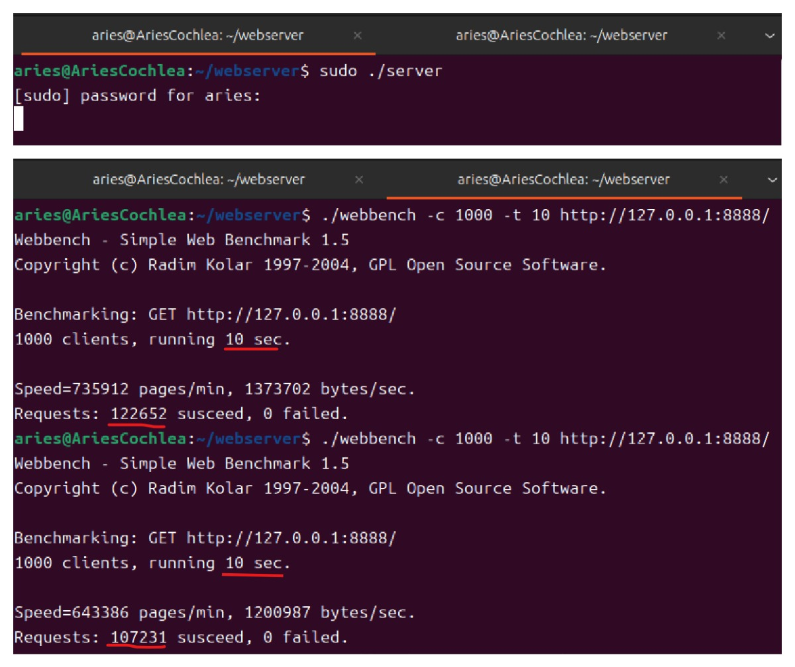
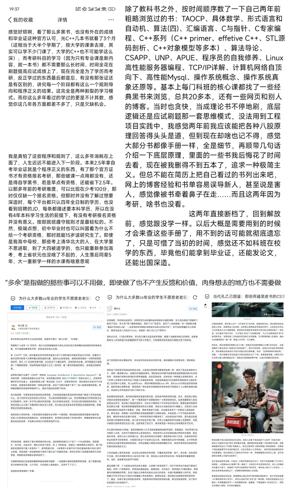
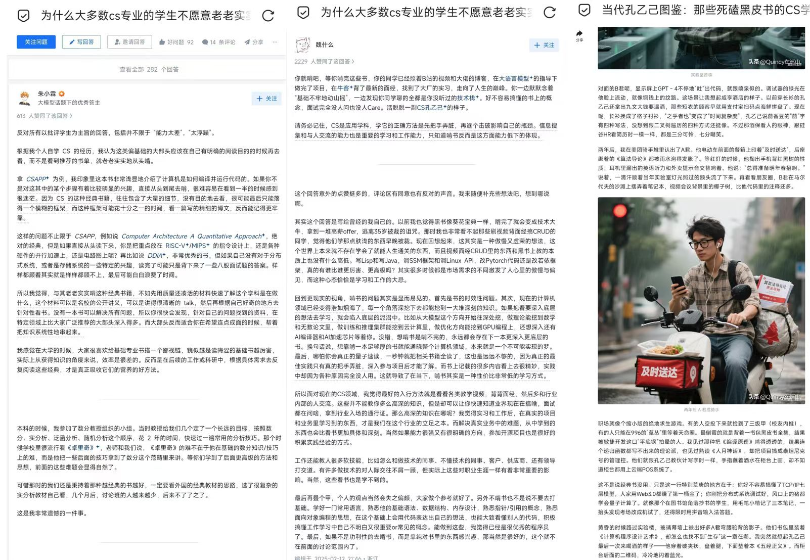
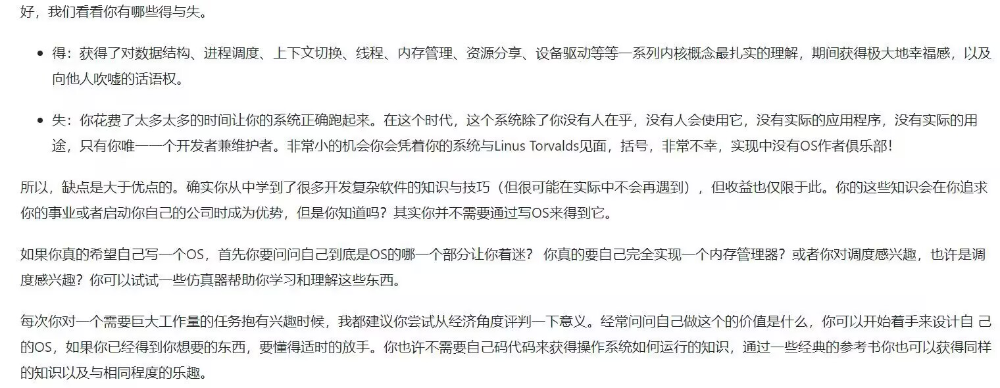
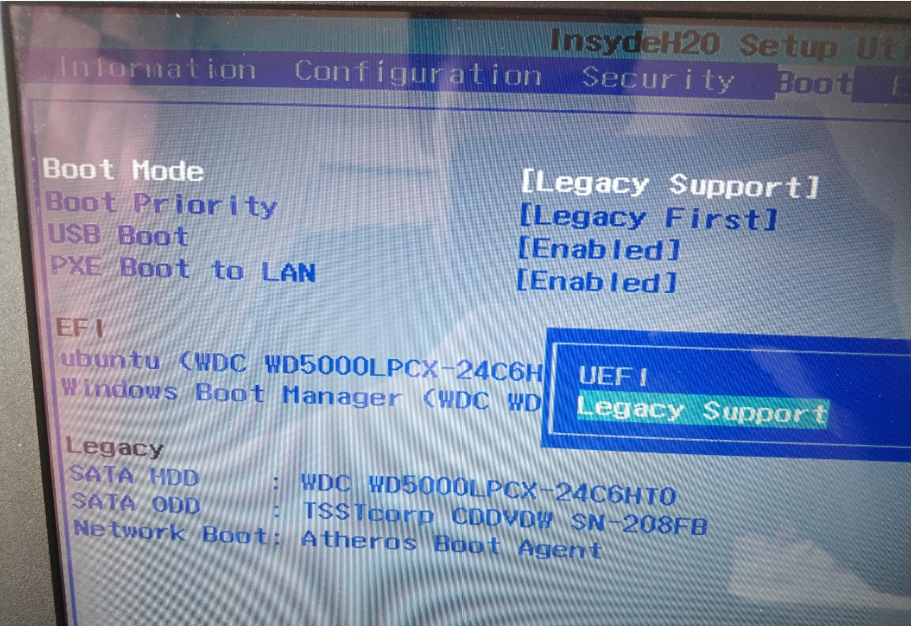
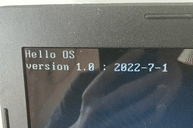
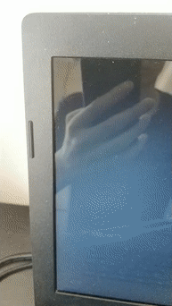
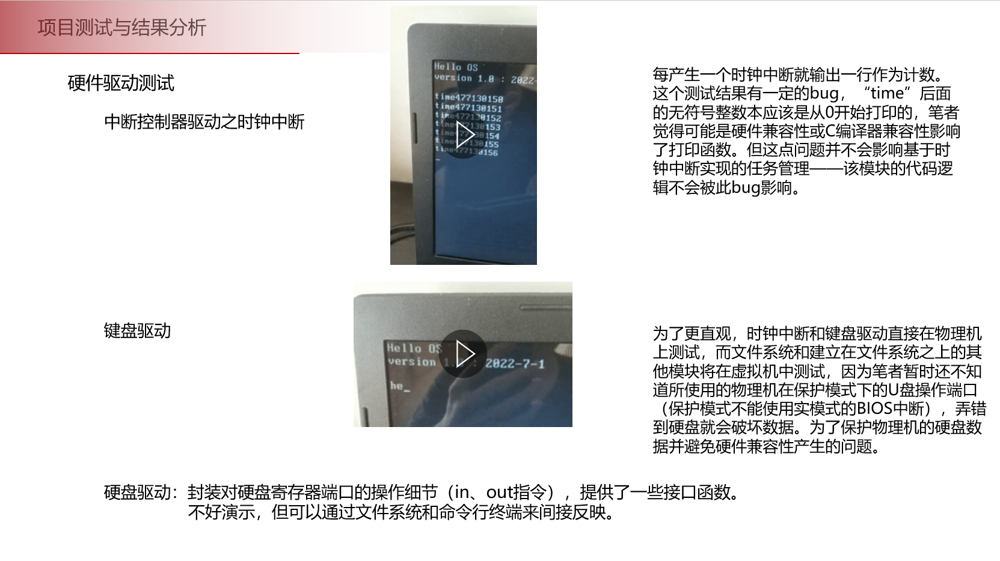
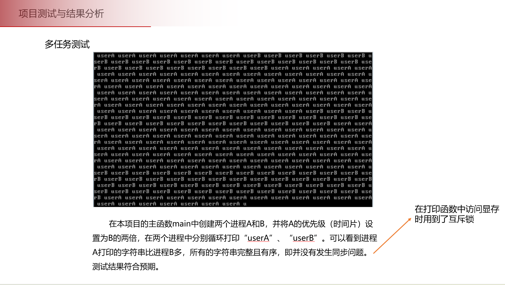
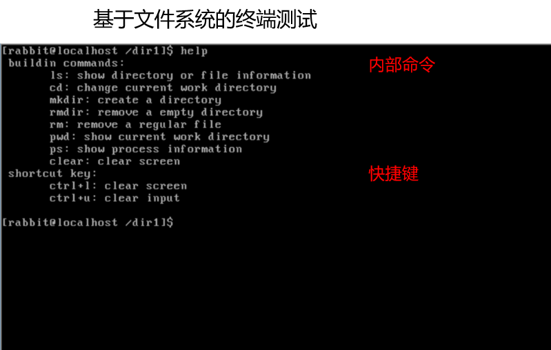

不要重复造轮子。人生真的苦短，时间流逝太快，世界变化更快。  

<br><br>


## 项目说明

使用cursor重写了自己Webserver的核心模块（多年前很经典的项目，后来变得烂大街，现在已经彻底过时了，写在简历上反而是减分项）并在虚拟机上的Ubuntu里跑通了，体会到了AI对普通的前后端方向的彻底颠覆。
* Reactor/Proactor  +  epoll（ET/LT） +  非阻塞IO  +  线程池
* 异步日志模块
* 数据库连接池，实现网页端的用户注册、登录功能；网页端可使用HTTP协议向服务器请求图片、视频等文件
* webbench压力测试


## 环境配置
* Linux、C++11、MySQL
* 服务器测试环境：
	* Ubuntu 24.04.4 LTS
	* MySQL 8.0.45
* 浏览器测试环境：
	* FireFox，本地回环地址127.0.0.1


## 项目启动
* 下载MySQL后登录
```
	// MySQL 有一种认证方式叫 auth_socket ，它的逻辑是：
	// 如果 MySQL 用户名 = 当前操作系统用户名，且该操作系统用户已登录，则允许直接连接，不需要密码。
	// 本项目只是个简单的玩具轮子（C++已经有很多成熟的网络库了，比如Boost.Asio、libevent等，写到这句的时候觉得以前花在这个项目上的时间实在是太愚蠢了，很多所谓的知识细节和底层原理真的像CS孔乙己一样），
	// 所以mysql没设置密码，直接登录：
	sudo mysql
	create database yourdb;    // 建立yourdb库
	USE yourdb;                // 创建user表
	CREATE TABLE user(
    	username char(50) NULL,
    	passwd char(50) NULL
	)ENGINE=InnoDB;
	//退出mysql
	quit; // 或exit;
```


* 运行
```
	//编译
	make
	//运行
	sudo ./server  //因为数据库用户名和系统管理员同名都是root，所以这里要用sudo
	//项目文件复制到Linux上可能遇到无法访问的问题，浏览器或日志会报错:You do not have permission to get file from this server.
	//则需要修改./file目录下文件的读取权限：
	chmod 644 ./file/*.html ./file/*.ico ./file/*.jpg ./file/*.mp4 ./file/*.png ./file/*.gif
	//再重新运行
	sudo ./server

	//等待几秒后，在本地Ubuntu浏览器地址中输入：
	http://127.0.0.1:8888/    //即可访问
```


## 效果演示

<div>
  
</div>


## 压力测试
```
	// -c表示客户端数，-t表示时间， QPS = 总请求数 / 总时间，即每秒可达到上万的并发连接（不同环境运行结果波动较大）
	// 运行服务器sudo ./server的同时再运行：
	./webbench -c 1000 -t 10 http://127.0.0.1:8888/    //我本人电脑的用户数量-c设置为10000会造成资源不足的错误，改成1000了
```
<div>
  
</div>


<br><br>
<br><br>
<br><br>
<br><br>
<br><br>

### 后记：
应该没多少人会看到这里，所以在这个隐蔽的地方再写点东西。我在用AI重做这些玩具轮子的时候，特别想快点结束，对项目所涉及的知识原理和底层细节也不像当初刚接触时那么在意，反而觉得枯燥和鸡肋，失去了耐心和兴趣，在学生时代就不喜欢复习旧东西，现在更多的心态像是在完成旧时代的几件未竟之事，跑通后再也不想碰它们，毫无成就感。就像下面一张截图里说的，看过的很多书现在全忘光了，重写这个项目时甚至连C++的语法都懒得复习，但谁能想到几年前我也是一名C++语言律师。然后现在特别想去迎接AI的新时代，继续学AI知识，做AI项目。计算机这种层层抽象的人造规则系统，向下层探索时应该适可而止，不然一辈子都不够你耗的。很多底层原理细节都是一些人造规则、人造知识、人造手册等繁文缛节，AI时代应该拒绝当CS孔乙己。以前初入编程，喜欢像学数学一样把每个角落每个细节都搞懂，与其刨根问底，不如多去探索一下技术（当成一种工具）的能力边界，如无必要勿造轮子，而是把精力放在真正需要人去参与解决的关键问题上。IT行业中重复造轮子就是明知道你做的不可能比前辈做得更好，却仍然坚持要做，比如一些框架、库、工具等等。但一个成熟的轮子，这不是简简单单一两个程序员就能完成的工作。放着成熟的轮子不使用，反而闷头造轮子，浪费时间都是小事儿，新造的轮子是否稳定，能否完成目标需求，在使用过程中会不会引起什么其他问题，这些对于一个新轮子来说都是未知数。牢记不要重复造轮子，禁止闭门造车，应该直接使用或学习已经成熟的工具、库、框架，以节省生命。在做一个项目之前，尽量先弄明白已经有哪些成熟的技术和经验，一定要多听业界一些前辈的建议，尤其是那些职位较高、在你觉得技术强的人，去看他们是怎么做事的，可以少走很多弯路。老老实实走主流的路，不要走野路子。技术视野、架构能力、领域经验、科研创新能力等，远比代码细节更重要，尤其在AI时代，代码文本的价值已经降到最低点了。

——从现在AI浪潮下的视角来看，这种轮子玩具确实没什么价值，放在这里就当为死去的青春做一个祭奠吧。
——不光这个项目如此闭门造车，人生也是如此道理，不该浪费太多时间在一些没意义的事实细节上。

<div>
  
  
  
</div>

<br><br>
<br><br>
<br><br>

其实当初还实现过一个OS内核轮子
<div>
  
</div>
鉴于本人的OS项目有不少bug，已经太监（网文圈子专属用词）并删库跑路了，这里贴出网上几个相对完整的实现链接，但他们的最后一两章仍然是有bug无法跑通的……<br><br>
https://github.com/yifengyou/os-elephant <br><br>
https://github.com/Charliechen114514/CCOperateSystem


<br><br>找到个更有学习价值的OS项目，但我已经没有学它的时间、兴趣、动力、意义了。代码和文档如下：<br><br>
https://gitee.com/lmos/cosmos <br><br>
https://uaxe.github.io/geektime-docs/%E8%AE%A1%E7%AE%97%E6%9C%BA%E5%9F%BA%E7%A1%80/%E6%93%8D%E4%BD%9C%E7%B3%BB%E7%BB%9F%E5%AE%9E%E6%88%9845%E8%AE%B2/%E6%93%8D%E4%BD%9C%E7%B3%BB%E7%BB%9F%E5%AE%9E%E6%88%9845%E8%AE%B2/


<br><br>最后贴一下自己以前的OS项目文档吧，主要是记录一下当时的心路历程……


<br><br>
<br><br>


-----------------------------------------------------------以下是原文档---------------------------------------------------------

<br><br>
<br><br>


# TinyOSKernel


## 项目说明：

本项目是参考《操作系统真象还原》（作者：郑钢）实现的32位OS内核。原书采用bochs虚拟机，本项目改用更先进的qemu，开发过程中阶段运行时基本上不会遇到棘手的问题，理论上所有运行环境直接下载最新版即可。除了开发环境不一样之外，本项目的代码有一些地方和原书不一样，我自认为改得比原书好。本项目止步于《操作系统真象还原》的第15.4.6节，代码总量只有几千行，我觉得已经完全足够了，对还剩下的三节内容已经失去兴趣和耐心了，但好在OS玩具已经初步成型。而一个项目是永远做不完的，永远可以加入新的功能和模块，永远在迭代，永无止境。到这里我觉得应该适可而止了，主要的原因是自己已经收获了想要的东西即对操作系统底层原理的深入学习而不是代码字里行间的细节和bug，而且走到这里的代价是远大于收获的，有点得不偿失。如果有对原作者的事迹有过了解https://github.com/yifengyou/os-elephant
就会知道他在写这本书时是完全辞职脱产，在房间的半平米角落里没日没夜的写了19个月才完成并出版，这件事的难度可想而知。但我不太推荐后来的人看这本书，也不建议做这种项目（玩具），因为你做的东西根本没人care，除了你自己……除非你是在校大学生要完成操作系统课程设计——本项目的价值也仅仅如此了，以及你可能在没有业界经验的同学面前吹嘘一下，获得一种比较低级的虚荣感，或者闭门造车自娱自乐。


注意：原书代码是不能直接运行在裸机（物理机）上的，需要做些调整，具体改动详见boot文件夹里的代码。

## 生产环境：
64位Intel机，4G运行内存；
Ubuntu20.04，
qemu-system-i386

## 环境配置：
### 软件更新
```
	//直接安装最新版即可
	sudo apt update && sudo apt upgrade && sudo apt autopurge && sudo apt autoclean
```
### 安装qemu-system-i386
```
	//其他的依赖包在项目编译过程中可以自行补充安装，建议参考一些网络博客或问AI。若想安装完整版的qemu，则sudo apt install qemu-system
	sudo apt install qemu-system-x86
```

<br><br>


## 运行方法：

### 在qemu虚拟机上运行
直接在本项目目录下运行脚本文件即可：
```
	sh ./run.sh

其中，./run.sh脚本的内容如下：


echo "制作60MB虚拟硬盘用于OS内核"
qemu-img create -f raw 60M.img 60M

echo "编译"

nasm -f bin -o build/mbr.bin  boot/mbr.asm
nasm -f bin -o build/loader.bin  boot/loader.asm

nasm -f elf32 -o build/print.o kernel/print.S
nasm -f elf32 -o build/kernel.o kernel/kernel.S
nasm -f elf32 -o build/switch.o kernel/switch.S

gcc -m32 -ffreestanding -nostdlib -fno-builtin -fno-stack-protector -fno-pic  -I ./kernel/include  -c  -o build/main.o  kernel/main.c
gcc -m32 -ffreestanding -nostdlib -fno-builtin -fno-stack-protector -fno-pic  -I ./kernel/include  -c  -o build/init.o  kernel/init.c
gcc -m32 -ffreestanding -nostdlib -fno-builtin -fno-stack-protector -fno-pic  -I ./kernel/include  -c  -o build/interrupt.o  kernel/interrupt.c
gcc -m32 -ffreestanding -nostdlib -fno-builtin -fno-stack-protector -fno-pic  -I ./kernel/include  -c  -o build/timer.o  kernel/timer.c
gcc -m32 -ffreestanding -nostdlib -fno-builtin -fno-stack-protector -fno-pic  -I ./kernel/include  -c  -o build/debug.o  kernel/debug.c
gcc -m32 -ffreestanding -nostdlib -fno-builtin -fno-stack-protector -fno-pic  -I ./kernel/include  -c  -o build/list.o  kernel/list.c  
gcc -m32 -ffreestanding -nostdlib -fno-builtin -fno-stack-protector -fno-pic  -I ./kernel/include  -c  -o build/string.o  kernel/string.c
gcc -m32 -ffreestanding -nostdlib -fno-builtin -fno-stack-protector -fno-pic  -I ./kernel/include  -c  -o build/bitmap.o  kernel/bitmap.c
gcc -m32 -ffreestanding -nostdlib -fno-builtin -fno-stack-protector -fno-pic  -I ./kernel/include  -c  -o build/memory.o  kernel/memory.c
gcc -m32 -ffreestanding -nostdlib -fno-builtin -fno-stack-protector -fno-pic  -I ./kernel/include  -c  -o build/thread.o  kernel/thread.c
gcc -m32 -ffreestanding -nostdlib -fno-builtin -fno-stack-protector -fno-pic  -I ./kernel/include  -c  -o build/console.o  kernel/console.c  
gcc -m32 -ffreestanding -nostdlib -fno-builtin -fno-stack-protector -fno-pic  -I ./kernel/include  -c  -o build/ioqueue.o  kernel/ioqueue.c
gcc -m32 -ffreestanding -nostdlib -fno-builtin -fno-stack-protector -fno-pic  -I ./kernel/include  -c  -o build/keyboard.o  kernel/keyboard.c
gcc -m32 -ffreestanding -nostdlib -fno-builtin -fno-stack-protector -fno-pic  -I ./kernel/include  -c  -o build/sync.o  kernel/sync.c
gcc -m32 -ffreestanding -nostdlib -fno-builtin -fno-stack-protector -fno-pic  -I ./kernel/include  -c  -o build/process.o  kernel/process.c
gcc -m32 -ffreestanding -nostdlib -fno-builtin -fno-stack-protector -fno-pic  -I ./kernel/include  -c  -o build/tss.o  kernel/tss.c
gcc -m32 -ffreestanding -nostdlib -fno-builtin -fno-stack-protector -fno-pic  -I ./kernel/include  -c  -o build/stdio.o  kernel/stdio.c
gcc -m32 -ffreestanding -nostdlib -fno-builtin -fno-stack-protector -fno-pic  -I ./kernel/include  -c  -o build/stdio-kernel.o  kernel/stdio-kernel.c
gcc -m32 -ffreestanding -nostdlib -fno-builtin -fno-stack-protector -fno-pic  -I ./kernel/include  -c  -o build/syscall-init.o  kernel/syscall-init.c
gcc -m32 -ffreestanding -nostdlib -fno-builtin -fno-stack-protector -fno-pic  -I ./kernel/include  -c  -o build/syscall.o  kernel/syscall.c
gcc -m32 -ffreestanding -nostdlib -fno-builtin -fno-stack-protector -fno-pic  -I ./kernel/include  -c  -o build/ide.o  kernel/ide.c
gcc -m32 -ffreestanding -nostdlib -fno-builtin -fno-stack-protector -fno-pic  -I ./kernel/include  -c  -o build/fs.o  kernel/fs.c
gcc -m32 -ffreestanding -nostdlib -fno-builtin -fno-stack-protector -fno-pic  -I ./kernel/include  -c  -o build/inode.o  kernel/inode.c
gcc -m32 -ffreestanding -nostdlib -fno-builtin -fno-stack-protector -fno-pic  -I ./kernel/include  -c  -o build/file.o  kernel/file.c
gcc -m32 -ffreestanding -nostdlib -fno-builtin -fno-stack-protector -fno-pic  -I ./kernel/include  -c  -o build/dir.o  kernel/dir.c
gcc -m32 -ffreestanding -nostdlib -fno-builtin -fno-stack-protector -fno-pic  -I ./kernel/include  -c  -o build/assert.o  kernel/assert.c
gcc -m32 -ffreestanding -nostdlib -fno-builtin -fno-stack-protector -fno-pic  -I ./kernel/include  -c  -o build/buildin_cmd.o  kernel/buildin_cmd.c
gcc -m32 -ffreestanding -nostdlib -fno-builtin -fno-stack-protector -fno-pic  -I ./kernel/include  -c  -o build/fork.o  kernel/fork.c
gcc -m32 -ffreestanding -nostdlib -fno-builtin -fno-stack-protector -fno-pic  -I ./kernel/include  -c  -o build/shell.o  kernel/shell.c

echo "链接"
ld -m elf_i386  -Ttext 0xc0001500 -e main  -z noexecstack   -o build/kernel.elf  \
   build/main.o build/print.o build/kernel.o build/switch.o build/init.o build/interrupt.o build/timer.o build/debug.o build/list.o \
   build/string.o build/bitmap.o  build/memory.o build/thread.o build/console.o build/ioqueue.o build/keyboard.o build/sync.o build/process.o \
   build/tss.o build/stdio.o build/stdio-kernel.o build/syscall-init.o build/syscall.o build/ide.o build/fs.o build/inode.o build/file.o build/dir.o\
   build/assert.o build/buildin_cmd.o build/fork.o build/shell.o 

rm -f  build/*.o

echo "去除ELF文件头，得到内核映像"
objcopy -O binary build/kernel.elf  build/kernel.bin   #改用ld也能运行：ld -m elf_i386  -Ttext 0xc0001500 -e main  --oformat binary  -o build/kernel.bin  build/kernel.elf 

echo "烧录"
sudo dd if=build/mbr.bin    of=60M.img  bs=512 count=1 conv=notrunc 
sudo dd if=build/loader.bin of=60M.img  bs=512 count=4 seek=2 conv=notrunc
sudo dd if=build/kernel.bin of=60M.img  bs=512 count=256 seek=9 conv=notrunc

echo "OS启动！"  #-m 32  表示分配32MB内存
qemu-system-i386 -m 32  -drive file=60M.img,format=raw,if=ide,index=0,media=disk \
                        -drive file=80M.img,format=raw,if=ide,index=1,media=disk
```


### 在物理机上运行

     1.准备一个不用的U盘（推荐至少2GB，注意备份数据。实验结束后，U盘可以重新格式化来恢复正常使用）；
     2.在Linux上确定你的U盘的设备名称：在插入U盘前后分别使用df命令获取磁盘文件系统的情况——
       插入U盘后，笔者这里多了一个/dev/sdb（这就代表我的U盘路径），注意最后的数字表示分区（笔者这里是sdb1），需要忽略；
       使用 sudo umount /dev/sdb 卸载该U盘上所有挂载到Linux的分区。
     3.修改usb.sh，将其中的设备路径改为你自己的U盘路径。这一步一定不能错！这里利用的是linux上的dd命令将二进制文件烧到U盘上。
     4.依次运行sh build.sh和sh usb.sh。此时U盘已经准备完毕。
     5.在电脑关机状态下打开BIOS（每种型号电脑打开方法不一样，请自行搜索），
       如果是UEFI（一般都会兼容传统的BIOS）则改为传统BIOS启动（具体改法因机而异，请自行搜索），选择USB HDD启动。
	 6.实验结束后，请按电源键强制关机，拔出U盘，改回曾经的BIOS或UEFI设置即可。
       
<div>
  
</div>


<br><br>


## 运行效果：
在物理机上测试键盘驱动和时钟中断：
<div>
  
  
  

</div>


<br><br>
为防止损坏电脑的硬盘数据，其他模块改在qemu虚拟机上测试：
<div>
  
  
</div>


<br><br>


### 项目介绍：


### 前置知识：
1. 操作系统、计算机组成原理和系统结构等理论知识；
2. 数据结构和算法，C语言，Intel汇编，内联AT&T汇编；
3. nasm汇编器，ld链接器，gcc编译器 ，make等工具。


### 主要功能：
1. 内核加载：依次实现MBR、内核加载器、实模式到保护模式的过渡、去除ELF文件头以进入C语言版内核。
2. 内存管理：使用内存分页机制实现虚拟地址到物理地址的映射，使用位图实现物理内存池和虚拟内存池来管理内存。
3. 中断和驱动：基于可编程中断控制器8259A实现时钟中断，基于键盘中断实现键盘驱动，基于硬盘中断实现硬盘驱动，基于0x80号中断实现系统调用。
4. 任务管理：基于PCB、内核栈、中断栈等数据结构实现内核线程，并基于内核线程和文件系统实现用户进程，再基于时钟中断和双向链表实现单核CPU下的时间片轮转调度算法。
5. 同步互斥：使用关中断实现原子操作，基于任务调度和阻塞队列实现信号量，基于二元信号量实现互斥锁。
5. 文件系统：基于硬盘驱动实现硬盘分区、超级块、inode、文件描述符、普通文件、目录文件；
                   实现文件操作功能：路径解析、文件检索，文件或目录的创建、打开、关闭、读写、删除。          
6. 命令行终端：基于文件系统和系统调用实现一个简单的shell终端，并实现了几个常用命令：ls，cd，mkdir，ps，rm等。
7. 进程通信：TODO：基于文件系统实现“管道”，基于内存管理实现“共享内存”。
8. 网络系统：TODO：知识水平还不够，可能得写网卡驱动，再从网络协议栈一层层写到手撕TCP，那就是另一个项目了……

——代码量大且繁琐，写到最后bug频发……只能放弃了……而且没写文件系统和shell之前能正常运行的任务调度功能在删除文件系统后莫名其妙不能正常运行了；找了几天都没找到那个bug，论版本管理的重要性……
       所以只能简单演示一下时钟中断和键盘中断的运行效果————有点可惜    
——大概率是不会继续写了，因为转行来的本菜鸟不打好基础、获得业界技术经验而是去造小玩具轮子是不可取的……
       对于在校生来说，感觉是不错的操作系统初学者编程实践，但对我来说，除了一些过时的硬件“知识”，其他的部分对自己的提升并不大。
       越写到后面越感觉有点不对劲，还不如多学几个业界常用的POSIX API或掌握Linux上的常用工具或去看内核某部分源码（如果真的感兴趣）来得实在。
       时间真不能像在校生那样“挥霍”……接近一个月来大部分时间都在熬夜和bug打交道，搞得生活都不正常了……然而只是解决bug却没有实质性的收获……
       不过，后面的内容虽然没写完，但还是精读了几遍，该掌握的知识和原理全掌握了。
  


### 项目讲解：TODO：

——作为一个非常简单的半成品，感觉没啥可讲解的……不过有些话我还是得说一下：

* 学习操作系统的目的
1. 并不是了解那些和寄存器、硬件等平台强相关的汇编代码部分，也不是PC机加电、从物理地址0xFFFF0运行BIOS（现在都是UEFI的时代了）、BIOS将MBR加载到物理地址0x7c00运行、MBR加载硬盘的活动分区（可引导分区）上的OBR、OBR将操作系统内核加载进内存运行，从实模式、保护模式到长模式的切换，打开A20地址线等一次性的任务——历史包袱而已，我觉得蠢爆了，这些“知识”毫无鸟用
2. 也不是实模式下的中断向量表到了保护模式中变成了中断描述符表、实模式的多段模式到保护模式里成了平坦模式、硬盘控制器分为PATA和SATA等这类“历史知识”…… 现在都直接利用GNU GRUB写系统了……
3. 而是关注操作系统重点概念（中断控制、内存管理、任务调度、同步互斥、进程通信、文件系统、系统调用等）的背后原理和联系，从软件角度来理解操作系统的运行机理。
4. 我认为最枯燥、最烦琐、最容易出bug的部分是文件系统的代码编写，写这些模块的时候深刻体会到了什么叫“不要重复造轮子”并被消磨了兴趣，像是长期闭门造车的陷在一个玩具demo的细节里自娱自乐，一个bug修几天，最后变得只想把这个没啥用的项目快点搞完了再也不碰它了。而且做完了也根本无人care甚至自己也不care，之前没日没夜花的那些时间是毫无价值的……书上的原代码和一些博客的代码，都是有一些隐藏的bug的……要说锻炼了什么能力，我觉得只锻炼了刷书能力和视觉检索能力，而且需要的也只是大量自由可控的整块时间和誓不罢休的一根筋的驴劲，脑子是唯一不需要带的东西……这个代码的逻辑难度和写个简单前端网页差不多，共同点都是代码量大，尤其是文件系统又臭又长，用代码量来营造一种有工作量和累的感觉，码农的“农”字终于体会到了。至于那些过时的硬件知识在我看来都是历史包袱，或者根本不叫“知识”，而只是一种人为设计的手册即人造规则系统，有些底层细节没那么神奇。那些暂时不知道的“知识”真的没那么神奇，对我现阶段毫无价值了。太纠结于代码细节的思维我觉得是需要警惕的，和bug和逻辑错误等非知识性、智力性因素打交道，徒耗生命，写错后浪费的大量时间远超写对后节省的时间。而且是别人的项目和代码，相当于为别人花以月记的时间找成千上万行里的bug，这时间省下来干点啥不好。而bug本来是人脑思维的非机械性导致的不可避免的错误。从来没有一件事像这样枯燥又巨耗时间，基本上一天到晚都是在复制或敲代码，逐句检查代码找bug。

<br><br>

——本代码仓库的象征意义大于实际意义，用来当作“墓志铭”，是一种尘封和祭奠死去青春的仪式感。
